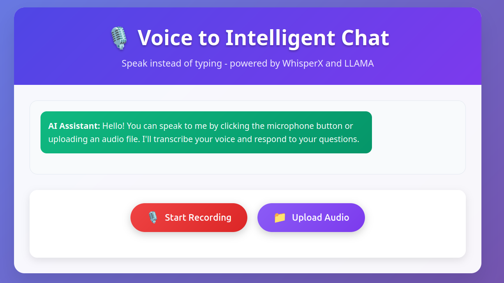
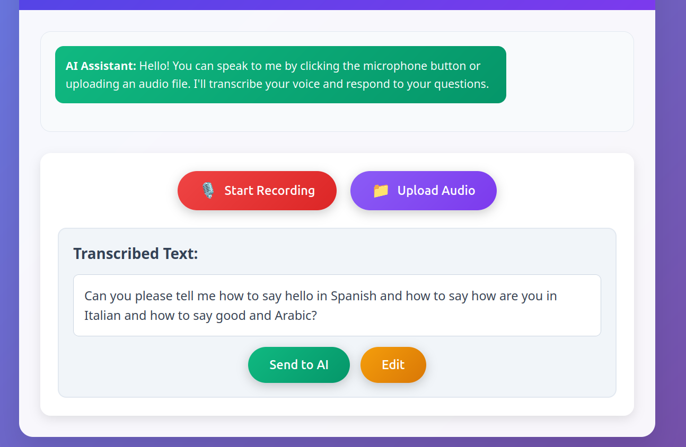
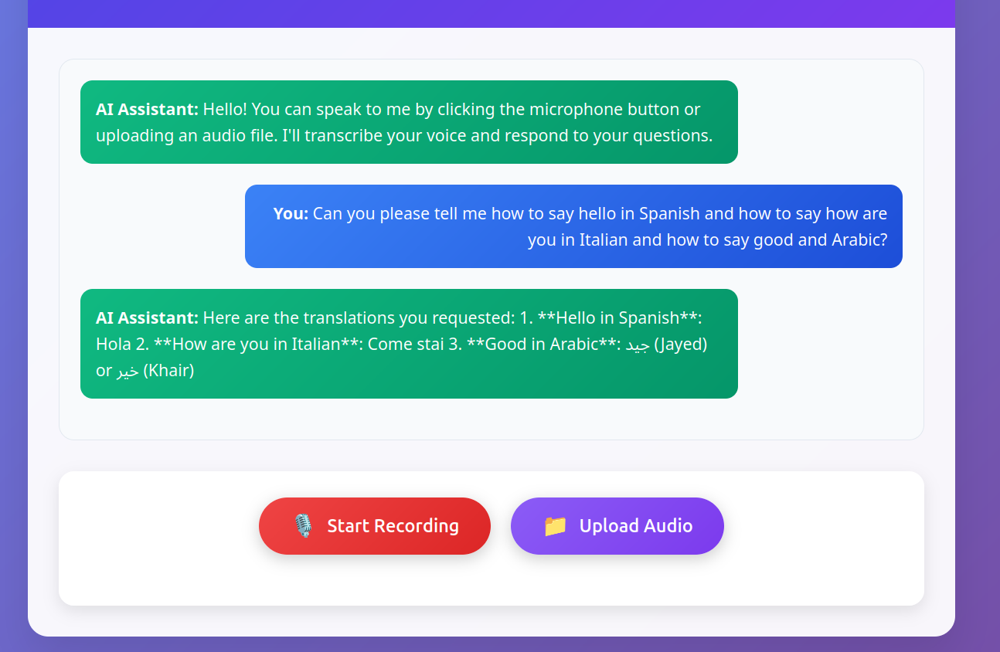

# 🎙️ Voice to Intelligent Chat

A voice-powered chat application that allows users to speak instead of typing. The app uses WhisperX for speech transcription and LLAMA 3.3 for intelligent responses.

## 📸 Screenshots

### Main Interface

*Clean and intuitive interface with voice recording and file upload options*

### Transcription Demo

*Real-time speech transcription with edit capabilities*

### Chat Example

*AI-powered conversation flow*

## ✨ Features

- 🎙️ **Voice Recording**: Real-time microphone recording
- 📁 **File Upload**: Support for various audio formats (MP3, WAV, FLAC, M4A, OGG)
- 📝 **Speech Transcription**: WhisperX integration with speaker info and timestamps
- 💬 **AI Responses**: LLAMA 3.3 70B integration via OpenRouter
- ✏️ **Edit Transcripts**: Modify transcribed text before sending
- 🎨 **Modern UI**: Responsive design with gradient backgrounds

## 🚀 Demo

1. **Record or Upload** your voice
2. **Review** the transcribed text
3. **Edit** if needed
4. **Send** to AI for intelligent response

## 🔧 Technologies Used

- **Backend**: Flask (Python)
- **Transcription**: WhisperX (tiny model for low resources)
- **AI Model**: meta-llama/llama-3.3-70b-instruct:free
- **Frontend**: HTML, CSS, JavaScript
- **API**: OpenRouter

## 📁 Project Structure

```
Voice-to-Intelligent-Chat/
├── 📄 app.py              # Main Flask application
├── 📄 requirements.txt    # Python dependencies
├── 📄 .env               # Environment variables (API keys)
├── 📁 templates/
│   └── 📄 index.html     # Main HTML template
├── 📁 static/
│   ├── 📄 style.css      # CSS styling
│   └── 📄 script.js      # JavaScript functionality
├── 📁 screenshots/       # Application screenshots
└── 📄 README.md          # Project documentation
```

## 🛠️ Installation & Setup

### 1. Clone the Repository
```bash
git clone https://github.com/abderrahmenyoussef/Voice-to-Intelligent-Chat.git
cd Voice-to-Intelligent-Chat
```

### 2. Install Dependencies
```bash
pip install -r requirements.txt
```

### 3. Configure Environment Variables
   Edit the `.env` file and add your OpenRouter API key:
   ```env
   # OpenRouter API Configuration
   OPENROUTER_API_KEY=your_api_key_here
   OPENROUTER_API_URL=https://openrouter.ai/api/v1/chat/completions

   # LLAMA Model Configuration (Optimized for low resources)
   LLAMA_MODEL_NAME=meta-llama/llama-3.3-70b-instruct:free
   LLAMA_TEMPERATURE=0.3
   LLAMA_MAX_TOKENS=500
   LLAMA_SYSTEM_MESSAGE=You are a helpful AI assistant. Be concise.

   # WhisperX Configuration (Minimal resource usage)
   WHISPER_MODEL_SIZE=tiny
   WHISPER_DEVICE=cpu
   WHISPER_COMPUTE_TYPE=float32
   WHISPER_BATCH_SIZE=4
   ```

   **Required**: Only `OPENROUTER_API_KEY` needs to be set. All other values have sensible defaults.

### 4. Run the Application
```bash
python app.py
```

### 5. Open in Browser
Navigate to: `http://localhost:5000`

## 🎯 How to Use

1. **🎙️ Voice Recording**: Click "Start Recording" to record your voice
2. **📁 File Upload**: Click "Upload Audio" to select an audio file
3. **📝 Review Transcript**: The transcribed text will appear for review
4. **✏️ Edit if Needed**: Click "Edit" to modify the transcript
5. **🚀 Send to AI**: Click "Send to AI" to get an intelligent response

## ⚙️ Configuration Options

### 🤖 LLAMA Model Settings
- `LLAMA_MODEL_NAME`: AI model to use (default: meta-llama/llama-3.3-70b-instruct:free)
- `LLAMA_TEMPERATURE`: Response randomness 0.0-2.0 (default: 0.3 for focused responses)
- `LLAMA_MAX_TOKENS`: Maximum response length (default: 500 for low resources)
- `LLAMA_SYSTEM_MESSAGE`: AI personality/behavior instructions

### 🎤 WhisperX Settings
- `WHISPER_MODEL_SIZE`: Model size (tiny, base, small, medium, large, default: tiny)
- `WHISPER_DEVICE`: Processing device (cpu, cuda, default: cpu)
- `WHISPER_COMPUTE_TYPE`: Computation precision (float32, float16, int8, default: float32)
- `WHISPER_BATCH_SIZE`: Batch size for processing (default: 4 for low resources)

## 🔑 API Configuration

The app uses OpenRouter to access LLAMA 3.3. Get your free API key from:
- 🔗 [OpenRouter.ai](https://openrouter.ai/)

## 🎵 Supported Audio Formats

- **MP3** (.mp3)
- **WAV** (.wav)
- **FLAC** (.flac)
- **M4A** (.m4a)
- **OGG** (.ogg)

## 🐛 Troubleshooting

### Common Issues

1. **"No speech detected"**: 
   - Check audio quality
   - Ensure microphone permissions
   - Try uploading a different audio file

2. **Slow transcription**:
   - Normal for low-resource settings
   - Consider upgrading to base model if you have more RAM

3. **API errors**:
   - Verify your OpenRouter API key
   - Check internet connection

### Performance Tips

- Use shorter audio clips for faster processing
- Close other applications to free up RAM
- Consider using GPU if available (change `WHISPER_DEVICE=cuda`)

## 📊 Performance Metrics

### Resource Usage (Tiny Model)
- **Memory**: ~1-2GB RAM
- **Model Size**: ~39MB
- **Processing**: ~2-3x real-time on i3 CPU

### Accuracy Trade-offs
- **Tiny Model**: Faster but less accurate
- **Base Model**: Better accuracy but slower
- **Large Model**: Best accuracy but requires more resources

---
